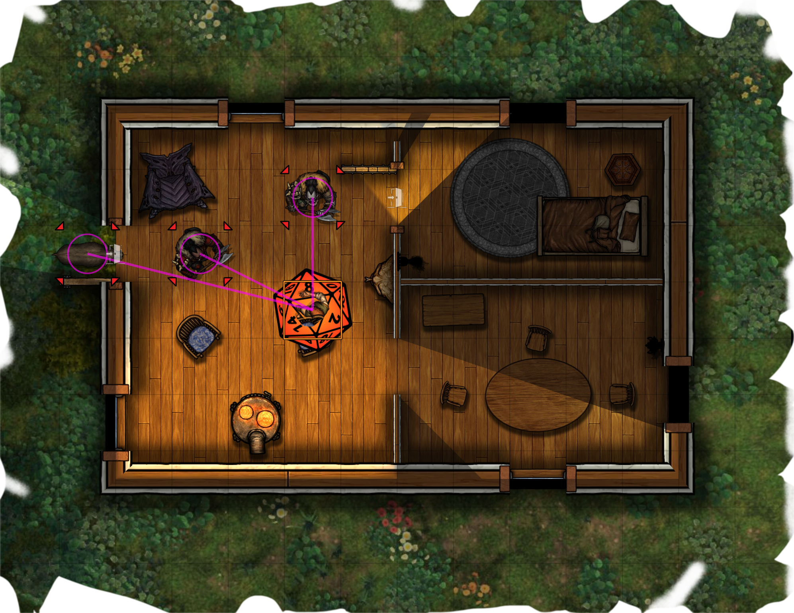
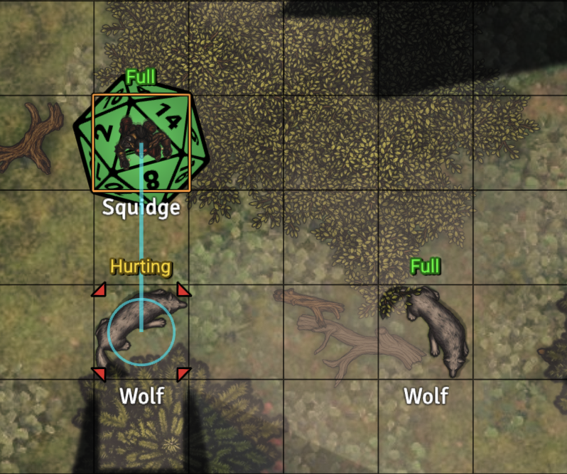
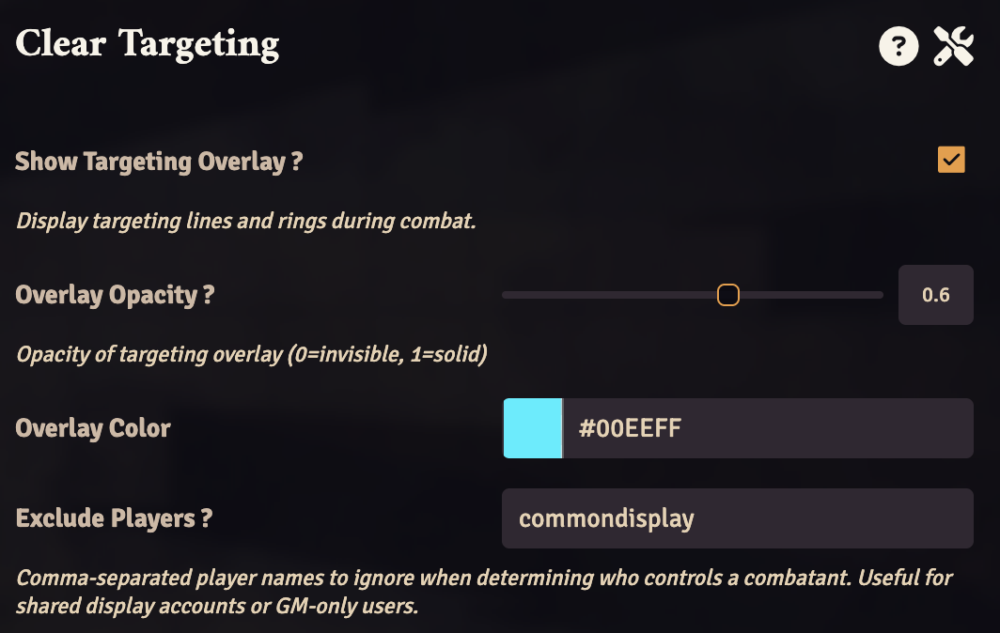

# Clear Targeting - Tactical Targeting Overlay

Make targeting intent visible during combat. Built for tactical tables.  

**Clear Targeting** draws simple, readable lines from the active combatant to their targets, helping GMs and players instantly understand who is targeting what during combat.  This module is game system agnostic, and shines in a game system with combat automation, such as pf2e.


---

## At A Glance

### Multi Target
<p>
  
</p>

### Single Target
<p>
  
</p>


### Settings
<p>
  
</p>

---

## Why this exists

In fast-paced encounters—especially with larger groups, targeting intent can get lost with standard pips:

- “Which one are you attacking?”
- “Oh, that target is outside my viewport.”
- “Roll doesn’t count—you didn't have anything targeted.”
- “Wait - that target was hidden.  Before your attack roll counts, make a flat check.”

This module makes targeting **obvious at a glance**, reducing ambiguity, keeping turns moving, and reducing the need to rewind turns.

---

## Features

- Draws lines from the **active combatant** to their targets
- Displays targeting on the **canvas** in real time
- Uses the **controlling player’s targets** (not just the GM’s)
- Optional **color and opacity controls**
- Per-user toggle (players can opt in or out)
- Support for **shared display setups** via optional **excluded users** (e.g. TV / Common Display accounts)

---

## Settings

### Show Targeting Overlay
Enable or disable the overlay for your client.

### Overlay Color
Choose the color used for targeting lines and circles.  
Supports the Color Picker module if installed.

### Overlay Opacity
Adjust how visible the overlay is (0 = invisible, 1 = solid).

### Exclude Players
Comma-separated list of player names to ignore when determining who controls a combatant.

Useful for: iPads, TVs running Monk's Common Display, or for GM-only players.

---

## How it works

- The module identifies the **current combatant**
- Finds the **player controlling that actor**
- Reads that player’s current **targets**
- Draws lines and target markers on the canvas

If no player is found, it falls back to a GM user.

---

## Installation

Install from the Foundry VTT module browser once the package is listed.

Until then, install by manifest URL:

```text
https://raw.githubusercontent.com/SuperNiCd/clear-targeting/main/module.json
```

Enable **Show Targeting Overlay** for any clients you want the overlay to show on, including GM.  The default setting is disabled.

---

## Release

1. Update `version` in `module.json` and add release notes to `CHANGELOG.md`.
2. Commit the release changes.
3. Create and push a matching tag, such as `v1.0.0`.
4. GitHub Actions will publish a release with `module.zip`.
5. Submit the package to Foundry VTT.

For the Foundry package version entry:

- Version Number: `1.0.0`
- Package Manifest URL: `https://raw.githubusercontent.com/SuperNiCd/clear-targeting/v1.0.0/module.json`
- Required Core Version: `13`
- Compatible Core Version: `13`

The stable install/update manifest remains:

```text
https://raw.githubusercontent.com/SuperNiCd/clear-targeting/main/module.json
```

---

## Design Philosophy

- Minimal visual clutter
- No required workflow changes
- Works with existing targeting systems
- Small, focused, and reliable

---

## Notes

- This module **does not modify targeting behavior**—it only visualizes it
- Targets must still be set correctly for system automation (e.g. saves, damage)
- Some systems or modules may change how targeting is handled

---

## License

MIT

---


## Feedback

If you find this useful—or something feels off—feel free to share feedback or ideas.
